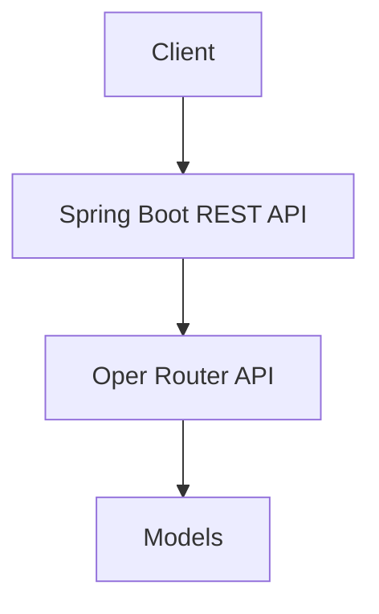

# Spring AI Oper Router Backend

[](LICENSE)

## Overview

Spring AI Oper Router Backend is a Java Spring Boot application that serves as an intelligent backend for routing and automation tasks. Leveraging AI-powered decision-making and seamless integration with the Oper Router APIs, this backend enables a simple demonstration for getting started.

## Features

- **Oper Router API Integration**: Connects to Oper Router APIs for advanced routing and automation.
- **RESTful Endpoints**: Exposes clean, documented REST APIs for getting cat facts.
- **Environment-based Configuration**: Securely manages API keys and environment variables via `.env`

## Tech Stack

- Java 21+
- Spring Boot
- Maven
- Oper Router API
- AI Libraries:  spring-ai-openai-spring-boot-starter

## Getting Started

### Prerequisites
- Java 21 or higher
- Maven 3.8+ (or Gradle)
- Oper Router API credentials
- OpenAI or other AI provider API keys

### Clone and Build

```sh
# Clone the repository
git clone https://github.com/deepak-sekarbabu/spring-ai-open-router
cd spring-ai-open-router

# Copy and edit environment variables
cp .env.example .env
# Edit .env to add your API keys

# Build and run
mvn clean spring-boot:run
```

### Configuration
- Edit `src/main/resources/application.yml` for model and API settings.
- Place your API keys in `.env` (e.g., `OPER_ROUTER_API_KEY`, `OPENAI_API_KEY`).

## Usage

### Example: Route Automation Request

```sh
curl --location 'http://localhost:8080/ai/cathaiku'
```

**Sample Response:**
```
Cat in quiet night
Whiskers dance in moon's soft light
Purrs a gentle song
```

## Architecture



## License

This project is licensed under the [MIT License](LICENSE).
